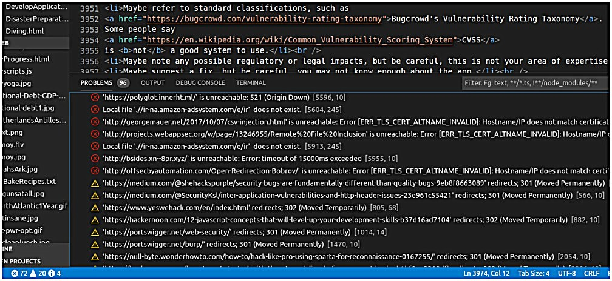

# HTML link checker
VSCode extension that checks for broken links in HTML files.


## Functionality
Checks for broken links in anchor-href, link-href, img-src, and script-src tags in current HTML document. It checks HTTP/HTTPS links by trying to access them on the internet, and checks relative links (../folder/file.html) by checking if the file exists on the local file system.

Also checks for badly-formatted mailto links, and duplicate local anchors (anchor-name, anchor-id).

Also checks for working HTTPS equivalents of HTTP links.


## Use
Open an editor window on an HTML file and then press `Alt+H`.

Broken links are reported via the standard error/warning/information diagnostic icons in lower-left of UI.

Click on the diagnostic icons and numbers to open the diagnostics pane.

Click on a diagnostic line, see that link highlighted in the source file, press `Alt+T` to open that URL in your browser.

If it's an HTTP link, press `Alt+M` to open the HTTPS equivalent of that URL in your browser.

Press `Alt+L` to clear all diagnostic messages generated by this extension.



Tip: After you do Alt+H and get diagnostics, work on the problems from bottom (last diagnostic) to top (first diagnostic).  That way the line numbers in the diagnostics don't change as you delete or add lines in the source.

To see/change settings for this extension, open Settings (Ctrl+,) / Extensions / HTML link checker.

To change the key-combinations for this extension, open File / Preferences / Keyboard Shortcuts and search for Alt+H or Alt+T or Alt+M or Alt+L.


### Settings
* addExtensionToLocalURLsWithNone: If a local file URL has no extension, add this extension to the filename before checking (default is ""; don't include "." in the setting).
* checkInternalLinks: Check #name links to targets inside current file (default is true).
* checkMailtoDestFormat: Check format of email addresses in mailto links (default is true).
* dontCheckURLsThatStartWith: Don't check URLs that start with any sequence in this comma-separated list (default is "127.,192.,localhost,[::1],[FC00:,[FD00:").
* localRoot: String prepended to links that start with "/" (default is ".").
* maxParallelThreads: Maximum number of links to check in parallel (range is 1 to 20; default is 20).
* processIdAttributeInAnyTag: #name link can be to any tag with ID attribute inside current file (default is true).
* reportHTTPSAvailable: Report if HTTP links have HTTPS equivalents that work ? (default is [check and report] "as Information")
* reportNonHandledSchemes: Report links with URI schemes not checked by the checker, such as FTP and Telnet (default is "as Information").
* reportRedirect: Report links that get redirected (default is "as Warning").
* timeout: Timeout (seconds) for accessing a link (range is 5 to 30; default is 15).
* userAgent: User-Agent value used in Get requests (default is "Mozilla/5.0 (X11; Ubuntu; Linux x86_64; rv:66.0) Gecko/20100101 Firefox/66.0").


### Limitations
* Tag name and href/src/id attribute must be on the same line.
* Doesn't know about comments; will find and check tags inside comments.
* Checks "#name" links to targets in current file, but not in other local or remote files.
* Doesn't check EVERY detail of the email address spec in mailto links.  Just a cursory check.

Note that checking for broken links is more of an art than a science. Some sites don't actually return 404, but send you to a landing page. For example, Azure.com works this way. You can go to https://Azure.com/foo/bar and it will happily redirect you to a sub-page of https://azure.microsoft.com/, with no 404 status returned. So take a status of "OK" with a grain of salt - you may not be arriving at the page you intend.

Also, browsers seem to be more tolerant than the library used by this link-checker.  The link-checker will report a lot of certificate-errors and such that browsers mostly ignore.

And checking is getting harder, with more URLs redirecting through GDPR-consent pages and such, or redirecting to an URL with a tracking parameter added, causing false positives.


#### Quirks
* If there are multiple identical tags with identical link-targets on same line (for example two Anchor tags with identical href targets), clicking on diagnostic for any of them takes you to first one in the source line.
* Doesn't check ANY of the email address format after "?", as in "mailto:a@b.com?subject=xyz".
* "://" is prepended to items in dontCheckURLsThatStartWith before matching; e.g. if you specify "localhost" the code searches for "://localhost" in URLs.

---


## Install
### From the Marketplace
Open Visual Studio Code and press `F1`; a field will appear at the top of the window. Type `ext install linkcheckerhtml`, hit enter, and reload the window to enable.

### From VSIX file
Either:
* In CLI, do
```shell
code --install-extension linkcheckerhtml-n.n.n.vsix
```
or
* In VSCode GUI, in the Extensions view "..." drop-down, select the "Install from VSIX" command.

### From source code
* Do a git clone to copy the source code to "linkcheckerhtml" in your home directory.
* In CLI, "cd linkcheckerhtml" and then "./CopyToHomeToRunInNormal.sh"

---


## Releases
### 0.2.0
* Copied from "Microsoft / linkcheckermd" and then greatly modified.
* Extension works, but probably has memory leaks, not much testing.

### 0.3.0
* Changed to use node-fetch module (https://github.com/bitinn/node-fetch) instead of broken-link.  But has bad hangs.
* Changed to use got module (https://github.com/sindresorhus/got) instead of node-fetch.  But has bad hangs.
* Changed to use axios module (https://github.com/axios/axios) instead of node-fetch.  Works, but hangs on some URLs.
* Changed to throttle so that it checks max of 4 links in parallel.
* Changed settings to use pull-downs: error, warn, info, don't report

### 0.4.0
* Finally nailed that hang bug.
* Added setting for timeout.
* Fixed timeout and redirect settings.

### 0.5.0
* Added Alt+T to open an URL in a browser.
* First release with a VSIX file.

### 0.6.0
* Got rid of: "href" or "src" has to be first attribute in the tag.
* Require at least one "." in mailto address's domain.
* Try to dispose memory properly to avoid leaks.
* Handle local files with "?args" on the end.

### 0.7.0
* Added localRoot setting.
* Fixed mailto that ends with "?".
* Added userAgent setting, and it definitely makes some sites happier.

### 1.0.0
* Increased default timeout to 12.
* Check local anchors (#name) in current file.
* Support anchor-id (HTML5) as well as anchor-name.

### 1.1.0
* Added settings about checking local anchors (#name) and ID attributes in current file.

### 1.2.0
* Moved repeated add-diagnostic code into a function.

### 1.3.0
* Added setting and code to check if HTTPS equivalent exists for HTTP address.
* Added Alt+M to open current HTTP URL as an HTTPS URL in browser.

### 1.4.0
* Briefly tested IPv6 addresses to see that at least they don't cause anything to blow up.
* Set default user-agent string to latest Firefox.
* Added dontCheckURLsThatStartWith setting and code.
* Increased default timeout to 15.

### 1.5.0
* Added "Using the extension" image.
* Better message when 0 files left to do.
* Added addExtensionToLocalURLsWithNone setting and code.

### 1.6.0
* Added Alt+L to clear all diagnostics belonging to this extension.
* Changed my email address.

### 1.7.0
* Fix README.

---


## Development
### To-Do list
* Create automated tests.
* Any way to note links that redirect to same link with a tracking parameter added ?  Answer seems to be no, Axios gives no way to get the URL that we were redirected to.
* A lot of code cleanup needed, move stuff into functions.
* Extension really is supposed to remove each diagnostic line after the corresponding source line is edited.
* Bundle extension to make it smaller/faster ? https://code.visualstudio.com/api/working-with-extensions/bundling-extension
* Can't really test IPv6 because my system and ISP have it turned off.
* Allow single-quotes on attributes ?  I thought HTMLHint didn't allow them, so I didn't support them.
* Don't check a link if it has rel="nofollow" ?  Probably should leave it as-is: check it.
* Any way to do retries inside axios ?  Apparently not.
* Memory leaks ?  Doesn't seem to be any tool to check an extension for leaking.  Maybe not possible, since extensions are running inside a huge framework of Electron or Node or something.
* Display a "busy" cursor ?  Can't.  Window.withProgress could put up a dialog, but then user would have to close the dialog manually every time, don't want that.  Doesn't seem to be a way to close that dialog programmatically.
* Click on diagnostic, do Alt+T or Alt+M to browser, come back to VSCode, cursor is in filter field of diagnostics pane instead of in source file.  More convenient if in source file.  But seems to be no way to do it.
* Multi-line tag (tag name and href/src attribute on different lines) silently ignored.  Would be a lot of work to deal with, given the simple way the code does parsing.

### Development Environment
I'm no expert on this stuff, maybe I'm doing some things stupidly.

I used:
* Linux Mint was 19 now 19.2
* VSCode was 1.29.1 (which said Node.js 8.9.3) now 1.39.0-exploration (which says Node.js: 12.4.0)
* node was 8.10.0 now 10.15.3
* npm was 3.5.2 now 6.9.0
* axios
* path
* fs
* Yeoman

I did:
* Ran Yeoman to make a Typescript test extension, then copied the entire node_module directory tree from there to linkcheckerhtml directory.
* Put path to node_module directory tree in vscode-typings.d.ts
* "sudo npm -g install --save axios" then copy /usr/local/lib/node_modules/axios to project node_modules

---

## Privacy Policy
This extension doesn't collect, store or transmit your identity or personal information in any way.  All it does is read the current editor window, do existence-tests on local files, open links to internet sites, and send internet links to your browser.


